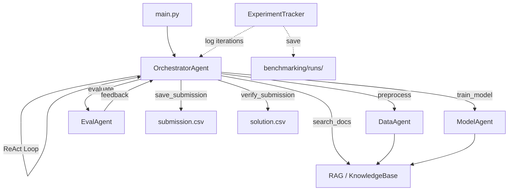
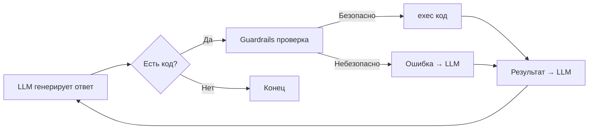
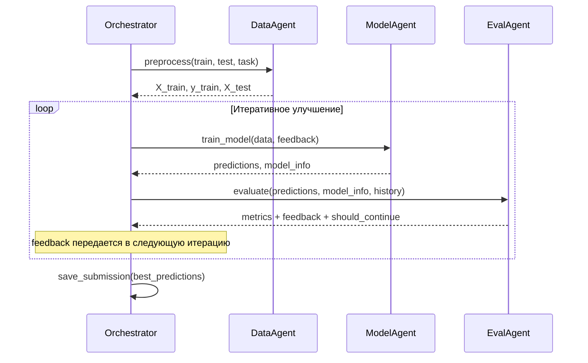

# Архитектура системы

## Общая схема

## Агенты

### OrchestratorAgent (оркестратор)

Центральный агент, управляющий всей системой. Работает в цикле ReAct (Reason-Act-Observe):

Оркестратор не имеет фиксированного пайплайна. LLM сам решает, какие агенты вызывать, в каком порядке, и когда остановиться.

### DataAgent (предобработка)

- Получает: пути к CSV, описание задачи, feedback
- LLM генерирует код предобработки (pandas, numpy)
- Код исполняется с auto-retry при ошибках
- Возвращает: X_train, y_train, X_test, feature_names

### ModelAgent (обучение)

- Получает: данные, feedback, time_budget
- LLM генерирует код обучения (lightgbm, xgboost)
- Код исполняется с auto-retry при ошибках
- Возвращает: val_predictions, test_predictions, val_true, model_name, model_params

### EvalAgent (оценка)

- Получает: предсказания, метаданные модели, историю
- Вычисляет метрики (MSE, RMSE, MAE, R²) без внешних зависимостей
- LLM анализирует результаты и генерирует feedback
- Возвращает: метрики + feedback + should_continue

## Feedback Loop

Feedback loop работает на local validation метрику: EvalAgent вычисляет MSE на validation split и формирует конкретные рекомендации для следующей итерации.

## Протокол взаимодействия агентов

Агенты общаются через функции, определённые в namespace оркестратора:

| Функция | Вход | Выход |
|---------|------|-------|
| `preprocess()` | paths, task, feedback | `dict{X_train, y_train, X_test, feature_names}` |
| `train_model()` | data, feedback, time_budget | `dict{val_predictions, test_predictions, val_true, model_name, model_params}` |
| `evaluate()` | predictions, model_info, history | `dict{mse, rmse, mae, r2, feedback, should_continue}` |
| `search_docs()` | query string | `list[str]` |

Каждый вход и выход валидируется (`agents/validators.py`).

## RAG модуль

BM25-поиск по документации установленных библиотек:

1. При старте система устанавливает 6 ML библиотек
2. `KnowledgeBase.index_library()` извлекает docstring из всех публичных объектов через `inspect`
3. Документы индексируются BM25 (k1=1.5, b=0.75)
4. Агенты вызывают `search_docs(query)` перед генерацией кода

Индексируемые библиотеки: pandas, numpy, scikit-learn, lightgbm, xgboost, optuna.

## Безопасность

- **Guardrails** (`agents/guardrails.py`): проверка кода на опасные паттерны перед исполнением
- **Restricted builtins**: из namespace удалены `eval`, `exec`, `compile`
- **Input validation** (`agents/validators.py`): валидация CSV, предсказаний, выходов агентов
- **Auto-retry**: при ошибке исполнения LLM автоматически исправляет код (до 5 попыток)
- **Time budget**: принудительная остановка по истечении времени

## Мониторинг и бенчмаркинг

- Каждый LLM-вызов логируется: timestamp, latency, success, token usage
- `ExperimentTracker` (`benchmarking/tracker.py`): сохраняет метрики каждой итерации в JSON
- `compare.py`: сравнение результатов между запусками
- Финальный отчёт: количество вызовов, токены, средняя задержка по каждому агенту
